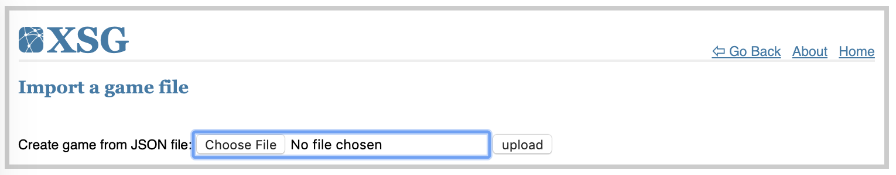

# XSG User Manual

## Table of Contents
1. [Introduction](#1-Introduction)
   - [Test drive XSG](#Test-drive-XSG)
2. [Student/Player interface](#2-StudentPlayer-interface)
   - [Try a demo](#Try-a-demo)
   - [Join a game](#Join-a-game)
   - [How to play – The interface](#How-to-play-–-The-interface)
3. [Instructor/Game administrator interface](#3-InstructorGame-administrator-interface)
   - [Quick start guide: *The HARD Game*](#Quick-start-guide-The-HARD-Game)
   - [Instructional material: introduction and debriefing slides](#Instructional-material-introduction-and-debriefing-slides)
   - [Creating a game](#Creating-a-game)
   - [Game setup and configuration](#Game-setup-and-configuration)
   - [Station automation logic](#Station-automation-logic)
   - [Game management](#Game-management)
   - [Game monitoring and exploring game results](#Game-monitoring-and-exploring-game-results)
   - [Importing game setup](#Importing-game-setup)
4. [Server administration](#4-Server-administration)
   - [Installation instructions](#Installation-instructions)
   - [Game server configurations](#Game-server-configurations)
   - [Server management](#Server-management)
5. [XSG: the code](#5-XSG-the-code)
   - [License](#License)
   - [Source Code](#Source-Code)
   - [Contribute](#Contribute)
   - [Publications on XSG](#Publications-on-XSG)
   - [Disclaimers](#Disclaimers)
   - [User Manual Version History](#User-Manual-Version-History)
   - [Copyright](#Copyright)

***

## 1. Introduction
The X-Supply Game (**XSG**) is an educational simulation game used to help participants explore the dynamics of real supply chains. The game is a team-based multi-player online simulation where each player take on the role of managing a virtual station in a simple supply chain. The game is played in turns, in which players analyze weekly standing of their stations and decide on orders to suppliers and shipment to customers. At the end of the game, individual and team performances are analyzed and discussed in groups.
XSG is influenced by previous supply chain management games, such as the beer game and the wood supply game, but it introduces several new concepts, including:

*   **Configurable supply chain design**: the simulated simple supply chain can be of virtually any design; number of nodes, number of layers, number of suppliers/customers per node (although this is currently limited to four for user interface simplicity). The only exception is that XSG cannot model supply chains containing closed-loops.
*   **Ordering/Shipping decisions**: a game can be configured to require players to consider either or both: ordering (from suppliers) and shipping (to customers) decisions. 
*   **Ordering/Shipping capacities**: stations (i.e. supply chain nodes) can have weekly ordering and/or shipping minimums and maximums.
*   **Triple-bottom-line objectives**: previous games focused on cost and/or service level as performance metrics for the game. XSG extends this with an environmental objective to require the player to consider all three objectives while making decisions. This is incorporated through the shipping decision, as explained in the transportation point below.
*   **Transportation environmental/monetary impact**: when a game is configured to require players to consider the shipping decision, an environmental impact based on truck utilization results and necessitate that players make decisions on shipment deferment or partial shipping to minimize the environmental impact. Truck utilization translates into transportation cost, allowing the players to fully engage in triple bottom line evaluation.

Other features include:

*   **Multi-platform compatibility**: XSG can be accessed from any modern computing device with a browser capable of supporting JavaScript, which includes almost all personal computers, tablets, and mobile devices. In addition, the server supports computing platforms where Python and Flask are available, including: OSX, Linux, and Windows among others.
*   **Open source**: XSG is open sourced allowing its extension by users (see license below).

The **XSG** name comes from the game ability to be configured in various supply chain designs, allowing it to model almost any "X" supply chain.

### Test drive XSG
You can use XSG on the following website, which is generously hosted by Zayed University:
[ZU's XSG](https://istm.zu.ac.ae/xsg).

***

## 2. Student/Player interface
### Try a demo
A single-player demo can be played to familiarize the student with the interface and fundamental game mechanics. This is recommended for students before participating in a group class activity. From the main menu select `Try demo game`, read the demo introduction/instructions, and click on `Start Demo`:


The demo play screen will appear. See the How to play section below for a description of the interface.

### Join a game
* From the XSG's main menu, select `Join game`:

* Select the game name, enter your name, enter the game's password, and then click `Go`; (game name and password are provided by the instructor):

* Select your station name and click `Go`; (you'll be assigned a station by the instructor):

* The player screen appears. Players make decisions in the lower right and left subsections and then click on `Send` button in the lower middle subsection to submit decisions. Players repeat this process every week of the simulation until the end of the game:


### How to play – The interface
The following figure briefly explains the player user interface:


XSG's user interface:

1) **Station/Turn area** (*top-mid*): includes information on station position, weekly progress, and turn timer (if enabled)

2) **Game area** (*top-left*): includes information on server connection, team's status, and details on game setup

3) **Performance area** (*top-right*): includes key supply chain performance indicators (KPIs); this is for the whole supply chain and so it reflects the team's performance as a whole

4) **Ordering area** (*bottom-left*): includes current deliveries received from suppliers, entry_field(s) for the player to enter their order(s) decision (if it is enabled in game settings), and ordering limits

5) **Shipping area** (*bottom-right*): includes current orders received from customers, entry_field(s) for the player to enter their shipment(s) decision (if it is enabled in game settings), and shipping limits

6) **Station status area** (*bottom-mid*): includes information on the station's inventory level, backorder level (total and separated by customer), and the `Send` button for submitting the players turn decision to the server

Every week players evaluate their station's standing and make their decision by considering:

* incoming deliveries from suppliers
* incoming orders from customers
* current inventory levels
* outstanding backorders
* current week shipping and/or ordering limits (if enabled in game settings)
* supply chain's performance
* Weekly progress and turn timer (if enabled in game settings)
* game setting (costs, delays, and transportation capacities)

The player's decision includes:
* units shipped to each customer, without exceeding available inventory
* units ordered from each supplier

***

## 3. Instructor/Game administrator interface

### Quick start guide: *The HARD Game*
This section describes briefly the process of conducting a HARD game activity in a classroom setting. A journal paper is currently under review describing this activity in detail; see Publications on XSG section toward the end of this manual. Detailed instructions on carrying out the steps highlighted here are detailed throughout this manual. In summary the instructor can follow the below steps:

* Send to the students a link to the XSG server, and ask the students to try a Demo game before arriving at class
* The instructor can create HARD game instances as needed through `Create game` option in the main menu, and then selecting `the humanitarian aid and relief distribution game` template
* Take note of the admin and player passwords. The game setup can be largely left to defaults. If less than six players are available to play a game, unmanned stations can be set to automatic operation using the two `Auto-decide` parameters. When done, click `Save Setup` to create the game
* Students can now join the game through the `Join game` option in the main menu. The instructor need to provide them with the player password and assign each student to a station. Each game has one play-password shared between all players
* The game waits for all stations to be registered on the server by studetns before the turn timer and the game starts
* The instructor may choose to project a multi-game monitor screen to the class during the game to show their progress and comparative standings; this is done through `Advanced menu` >> `Monitor competition`
* When all teams complete their games, the instructor may choose one of the games to use for discussion purposes in the debriefing sessions; this can be doe through the `Results` button
* The instructor may choose to start with the `inventory-backorder` KPI and hide all graph lines using `Toggle Visible Stations`, and then discuss the supply chain dynamics by incrementally showing the stations from upstream to downstream

### Instructional material: introduction and debriefing slides
The following slides may be used by instructors to help introduce the HARD game to students and then guide the debriefing session afterwards:

* [Introduction slides](./HARD_Intro.pptx )
* [Debriefing slides](./HARD_Debrief.pptx)

### Creating a game
* From the XSG's main menu, select `Create game`:

* Select a game template to base your new game on and then click `Go`:

* Configure your new game and save the settings. The game is now ready and visible to students. For more information on game configuration see the following section.

### Game setup and configuration
XSG games can be configured in a wide variety of ways, this section explains the different setting used to accomplish this. Attributes with `*` to their left are mandatory and cannot be left empty.

Game setup is split into five sections, all are mandatory except for `Game script`:

1) **Game main setup**: defines general game configuration


|Attribute|Description|
|:--|:--|
Game name|A unique name to identify your new game; must be unique across all games existing on the server at that time
Admin password|Game-instructor/administrator password; used for managing the game
Player password|Player/student password; used for registering players into the game
Length|Game simulation length in weeks (i.e. turns)
Game expiry|Number of days the game will remain on the server before it is auto-purged. Please do not use excessively large numbers as it would lead to server over-crowding with games. A value less than 120 days is recommended
Turn time|Player decision time limit in seconds; -1 deactivates the timer, such that a turn is completed only when all players enter their decisions

*Note: The following attributes are not editable at this time: `Target zero backorders in auto-ordering` and `Auto order method`. However, they can be set/changed in the game JSON setup file before importing. These attributes are controlled by the following JSON file settings: `quick_backorder_recovery` (default is False) and `auto_order_method` (default is 'XSG'). See Station automation logic section for more info.*

2) **Demand points**: defines demand points used to generate demand for the network; at least one is required to define a network. *(points can be added to or removed from the game using the `+`/`-` symbols; their appearance order is irrelevant)*


|Attribute|Description|
|:--|:--|
Demand point name|A unique name for the demand point; must be unique across all demand points and stations in the game
Weekly demand|A list of demanded units; list size must be equal to the game's number of weeks (see #1 above). Each week's demand is entered as an integer. Weekly demand is hidden from players until the game reaches that week in the simulation

3) **Network stations**: defines network stations; at least one station is required to define a network; stations can be player controlled (manual) or CPU controlled (automated). *(stations can be added to or removed from the game using the `+`/`-` symbols; their appearance order is irrelevant)*


|Attribute|Description|
|:--|:--|
Station name|A unique name for the station; must be unique across all demand points and stations in the game
Player name|*Optional*, will be over-written by the player registration menu (when the player enters the game)
Auto-decide shipments|If checked, XSG will automatically calculate shipments every week. The player will not see a box on their screen for this decision. If unchecked, the player will make this decision. For more information, please see the below section on `Station automation logic`
Auto-decide orders|If checked, XSG will automatically calculate orders every week. The player will not see a box on their screen for this decision. If unchecked, the player will make this decision. For more information, please see the below section on `Station automation logic`
Holding cost|Cost of holding an unit for a week ($/unit/week)
Backorder cost|Cost of not fulfilling an unit ordered for a week ($/unit/week); backorders wait forever!
Transport cost|Cost of shipping one truckload ($/truck)
Transport size|Truck capacity (units/truck)
Shipping delay|Shipment transit time between a supplier and a customer (weeks)
ordering delay|Processing time before a supplier receives a customer order (weeks)
Queues initial quantity|Value used to initialize order/shipment queues for week 1 (units); units in existing shipments and orders when the game starts
initial inventory|Inventory count at the start of simulation (units)
Safety stock|Inventory level that defines safety stock level (units)
Weekly order minimum|Weekly ordering limit (minimum units); A list of integers defining weekly limit in units; if the list size is not equal to the game's number of weeks (see above) it will be trimmed or automatically expanded
Weekly order maximum|Weekly ordering limit (maximum units); A list of integers defining weekly limit in units; if the list size is not equal to the game's number of weeks (see above) it will be trimmed or automatically expanded
Weekly ship minimum|Weekly shipping limit (minimum units); A list of integers defining weekly limit in units; if the list size is not equal to the game's number of weeks (see above) it will be trimmed or automatically expanded
Weekly ship maximum|Weekly shipping limit (maximum units); A list of integers defining weekly limit in units; if the list size is not equal to the game's number of weeks (see above) it will be trimmed or automatically expanded

4) **Network connections**: defines connections (i.e. links) between nodes (stations and demand points); Supplier->Customer; all nodes must be connected to at least one other node; a network must be fully connected (cannot be reduced to smaller networks without losing links)


|Attribute|Description|
|:--|:--|
Supplier|Node name (stations only); must be exactly as entered by the user (see `station name`)
Customer|Node name (stations and demand points); must be exactly as entered by the user (see `Station name` or `Demand point name`)


5) **Game script**: *optional*, defines a scenario script; series of message displayed to the players at set weeks to help with the game narrative


|Attribute|Description|
|:--|:--|
Week|the week at which a message is displayed o the players
Message|the text displayed to players at the week defined above

When done configuring the game, click `Save Setup` to save move on from the game configuration screen. `Toggle Auto-Decisions` toggles both auto-decision settings across all nodes in the network. **Warning**: saving setting for an existing game resets game progress and data.


### Station automation logic
Station automation is dictated by two `Auto-decide` parameters in the stations' section of the game configuration screen: `Auto-decide orders` and `Auto-decide shipments` (see above).

When both auto-decide orders and shipments are enabled, the station is completely automated, and the player does not have an option to control it. If one or both of the decisions is not automated, the player is presented with entry-fields in the player screen to make these decisions.

The following describes the automation logic used when these option are enabled:

#### A) Auto-decide orders:
``` python
if quick_backorder_recovery == True:
  ORDER = backorders + safety_stock - inventory - round(outstanding_orders/2) 
else:
  ORDER = backorders + safety_stock - inventory - outstanding_orders

Limit ORDER To Weekly_Limits (minimum must non-negative)

Distribute ORDER to suppliers according to their outstanding_orders (inversely proportional)
```

#### B) Auto-decide shipments:
``` python
SHIPMENTS = backorders + current_orders

Limit SHIPMENTS To Weekly_Limits and inventory
If weekly_minimum_limit > inventory:
  SHIPMENTS = 0

Distribute SHIPMENTS to customers according to their backorders (proportional)
```  

### Game management
Instructors can manage games using the `Game administration` screen:
* From the XSG's main menu, select `Advanced menu`:

* From the advanced menu, select `Admin game`:

* Select game, enter its administrator password, and click `Go`

* The Game Adminstration menu appears:

* From the menu instructors can:
  * View a network diagram representing the supply chain using `Show Supply Chain`; note that the network's layout is interactive and the player's station is displayed in bright blue color
  
  * View game results using `Show Results`; see Game monitoring and exploring game results below
  * Show game configuration using `Show Setup`
  
  * Edit game configuration using `Edit`; see Game setup and configuration above
  * Reset a game's progress and data using `Reset`
  * Export game settings to a JSON file using `Export`; this file can be used later to import that game setup and create a similar game instance
  * Delete a game using `Delete`
  * Copy game setup to a new game instance using `Copy`
  * Rename a game using `Rename`

### Game monitoring and exploring game results
Instructors can monitor game progress individually or collectively:

#### A) Monitoring games individually:
Using the `Game administration` >> `Show Results` menu selection, a game can be monitored and its results explored:


The game monitoring interface shows the following:
* Game status: weekly progress, connected stations, and stations that are yet to submit their decision for the week
* Table of Station KPIs
* Total cost disk chart (percentages)
* KPI Line charts - illustrating performance for the whole supply chain and individual stations; individual lines on the charts can be hidden or made visible by clocking on their legend item. The following KPIs are available:
  * Cost
  * Fulfillment
  * GreenScore
  * Orders
  * Inventory and Backorders
  * Inventory - Backorders (Available inventory)
  * Deliveries
  * Shipments
  * Extra shipments

The interface also include the following buttons:
* `Refresh Player Names` - to reflect name changes after the interface have been constructed (when a player logs in after the interface is displayed)
* `Toggle Visible Stations` - hide visible lines and show hidden lines in line charts
* `Show supply chain` (see above)
* `Compare stations` displays a stations' KPI radar graph. Station data can be hidden or shown by clicking on the legend item:


#### B) Monitoring a group of games collectively:
* From the XSG's main menu, select `Advanced menu`:

* From the advanced menu, select `Monitor competition`:

* Select games to monitor, enter their administrator passwords, and click `Go`

* The multi-game monitor interface appears:


The multi-game monitoring interface shows the following:
* KPI line chart comparison. The following KPIs are available:
  * Cost
  * Fulfillment
  * GreenScore
* Table of game progress and KPIs, including stations connectivity and turn reporting columns. Each game row includes:
  * a reset button (circular arrow) to quickly reset a game's progress and data
  * a link to game results, to show the individual game monitoring screen

### Importing game setup
A game can be created using a previously exported game setup file using the following:
* From the XSG's main menu, select `Advanced menu`:

* From the advanced menu, select `Import game`:

* Select game setup file and click `upload` 


***

## 4. Server administration
### Installation instructions
You may install XSG on your computer as a python3 package to test it:

*   Clone the project's repository or download its zip file from [github.com](https://sinansalman.github.io/xsg/).
*   Unzip the file to a folder on your hard drive and rename the resulting folder to 'xsg'.
*   Install the python package and start it.

The following was tested on MacOS with a new anaconda environment initialized to python 3.6:

``` bash
git clone https://github.com/SinanSalman/xsg.git
cd xsg
pip install .
./start_in_debug_mode.sh
```

Windows installation and use was not tested but should follow similar steps. To install the package for development purposes use: ```pip install -e .```

You may also install XSG on Web server. The following tutorials provide help on setting up XSG (a Flask application) as a WSGI application on an Apache server:
*   [DigitalOcean's tutorial on serving flask applications with uWSGI on CentOS 7](https://www.digitalocean.com/community/tutorials/how-to-serve-flask-applications-with-uwsgi-and-nginx-on-centos-7).
*   [How To Flask, Python, Centos7, Apache, uWSGI 7](https://mitchjacksontech.github.io/How-To-Flask-Python-Centos7-Apache-uWSGI/).

### Game server configurations
The game server can be configured using settings found in the `config.json` file:

Setting|Description
---:|:---
SECRET_KEY|secret random text used to encrypt users' sessions
GameStatusData|Server status file; where games are saved between launches
USERNAME|Server administrator username
PASSWORD|Server administrator password
MAX_GAMES_MONITORED|integer; limits the maximum number of games to be monitored by an instructor
SECONDSAWAY_TO_DISCONNECT|integer; number of seconds before a user is considered inactive and automatically disconnected
SECONDS_TO_REFRESH_PLAY_SCREEN|integer; number of seconds between player screen refreshes
SECONDS_TO_REFRESH_GAME_MONITOR|integer; number of seconds between game monitor screen refreshes
SECONDS_TO_REFRESH_GAME_DEBUG|integer; number of seconds between debug screen refreshes (undocumented feature for developing/debugging)

### Server management
Server adminstration menu can be accessed using the `[Sever URL]/admin` address (e.g., for a server booted into debugging mode: `127.0.0.1:5000/admin`). Once logged in using the server username/password the following screen appears:


Server state (in-memory data) can be saved and loaded via this menu. Note that the server does not automatically save this information so it's the server's administrator responsibility to do this between reboots/shutdowns.

***

## 5. XSG: the code

## License
XSG is released under the GPLv3 license, which is available at [GNU](https://www.gnu.org/licenses/gpl-3.0.en.html).

## Source Code
The source distribution contains Python, JavaScript, CSS, HTML code, in addition to a sample of supply chain game designs, including: the root-beer game and the wood supply game. The code makes use of several libraries including Python-Flask, jQuery, AlpacaJs, charts.js, and vis.js. The game analytical engine is written exclusively in Python.

## Contribute
Code submissions are greatly appreciated and highly encouraged. Please send fixes, enhancements, etc. to SinanSalman at GitHub or sinan\[dot\]salman\[at\]zu\[dot\]ac\[dot\]ae.


## Publications on XSG
* Alaswad, S. & Salman, S. (2020) Humanitarian aid and relief distribution (HARD) game. *Advances in Engineering Education*, 8(2). [[Download pdf](https://files.eric.ed.gov/fulltext/EJ1269642.pdf)]
* Salman, S. (2019) Upgrade Your Teaching Game: Using Simulation Games in Supply Chain Management Education, *OR/MS Today Magazine, INFORMS*, June 2019. [[link](https://doi.org/10.1287/orms.2019.03.07)]
* Alaswad, S., Salman, S., AlHashmi, A., AlMarzooqi, H., & AlHammadi, M. (2019). The Effect of Demand Variability on Supply Chain Performance. *Proceedings of the 8th International conference on Modeling, Simulation, and Applied Optimization*, Bahrain. [[Download pdf](https://doi.org/10.1109/ICMSAO.2019.8880346)]
* Salman S. & Alaswad S. (2018) The X-Supply Game. *Proceedings of the 2018 Industrial and Systems Engineering Conference*. [[Download pdf](https://sinansalman.github.io/xsg/docs/2018IISE_XSG_Paper.pdf)]
* XSG presentation at the *2018 Industrial and Systems Engineering Conference*, Orlando, FL, USA, May 2018. [[Download pdf](https://sinansalman.github.io/xsg/docs/2018IISE_XSG_Presentation.pdf)]

## Disclaimers
*   XSG uses Google analytics to measure its use.
*   Every game includes an expiry parameter to keep the server from crowding. When a game expires its setup and data are automatically erased. You may choose to export your game setup file to keep on your computer, however, game player data cannot be exported.
*   Games and/or games player data may also be lost due to upgrades or new feature introductions. You may export your game setup file and take screenshots of game results to keep on your computer.

## User Manual Version History
*   Nov 11th, 2021    v0.16, edit UserManual; add TOC & update publications
*   Aug 14th, 2019    v0.15, add UserManual

## Copyright
2017-2022 Sinan Salman, PhD.